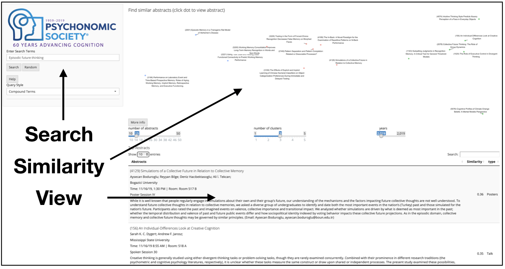
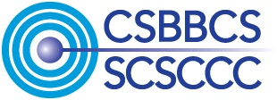
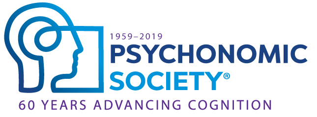

```{r, echo=FALSE}

```

<style type="text/css">
.title {
  display: none;
}
</style>

The Semantic Librarian project creates search engines using vector-space models of semantics. It converts words, sentences, and documents to points in a high-dimensional meaning space, where texts that are closer together are more similar in their semantic meaning.

<div class = "row">
  
<div class = "col-md-6">

### Example

A major aim of the project is to create tools for creating vector spaces from documents, and then presenting the meaning space to a user so they can interact with it. The example shows a recent deployment of the Semantic Librarian for Conference Program abstracts. User can use semantic similarities between search terms, documents, and document authors to find conference abstracts that may be of interest to them. The Shiny app UI presents a multi-dimensional scaling solution showing the similarity space of returned items, as well as a table of documents ranked by similarity.
</div>
  
<div class = "col-md-6">


```{r, echo=FALSE}

```

</div>

</div>

### Browse

We have developed a few different Semantic Librarians, which are currently hosted as Shiny apps. You can explore them here. 

<div class = "row">
<div class = "col-md-6">
### [APA](http://crumplab.shinyapps.io/SemanticLibrarian/)

American Psychological Association journal abstracts from 1890s-2016.

</div>
<div class = "col-md-6">
```{r, echo=FALSE, out.width="200"}

```

</div>
</div>

<div class = "row">
<div class = "col-md-6">

### [CSBBCS](http://crumplab.shinyapps.io/CSBBCS2019/)

Conference abstracts for Canadian Society for Brain and Behavioural Sciences 2019 meeting.

</div>
<div class = "col-md-6">
```{r, echo=FALSE, out.width="200"}

```

</div>
</div>

<div class = "row">
<div class = "col-md-6">

### [SCiP](http://crumplab.shinyapps.io/SCiP2019/)

Conference abstracts for Society for Computers in Psychology (last 10 years)

</div>
<div class = "col-md-6">
```{r, echo=FALSE, out.width="200"}
knitr::include_graphics("imgs/scip.png")
```

</div>
</div>

<div class = "row">
<div class = "col-md-6">

### Psychonomics 2019

Conference abstracts for Psychonomics 2019...In progress

</div>
<div class = "col-md-6">
```{r, echo=FALSE, out.width="200"}

```

</div>
</div>


